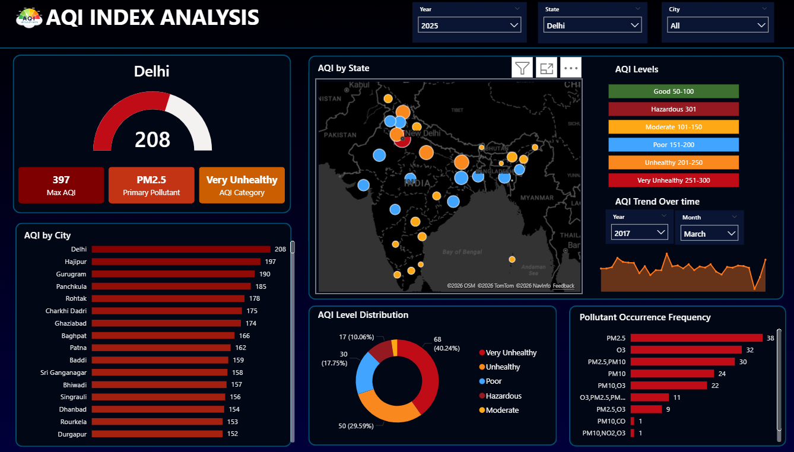
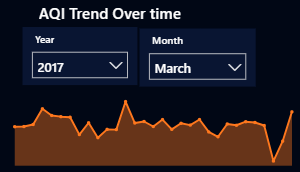
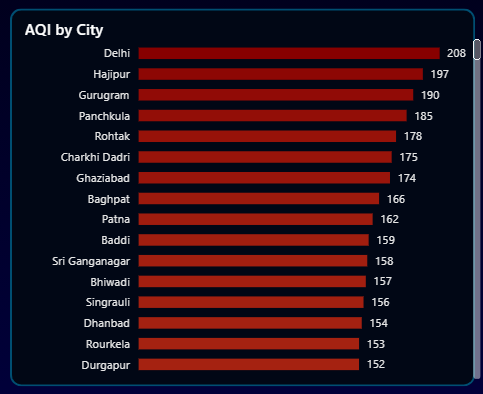

# 🌍 AQI Index Analysis – Power BI Dashboard

## 📌 Project Overview
**AQI Index Analysis** is a Power BI dashboard project that analyzes Air Quality Index (AQI) data across different **states and cities of India**.  
The dashboard provides insights into pollution levels, AQI categories, city-wise comparison, and AQI trends using interactive visuals.

---

## 🛠 Tool Used
- Power BI

---

## 📊 Dashboard Preview

---

## 🔍 Key Insights
- Analyzed **average AQI values** by state and city  
- Compared **city-wise AQI levels** to identify highly polluted cities  
- Categorized AQI into **Good, Moderate, Poor, Unhealthy, Very Unhealthy, and Hazardous**  
- Visualized **AQI trends over time** using line charts  
- Used **map visualization** for regional AQI comparison  
- Added slicers for **Year, State, and City** for interactive filtering  

---

## 📈 AQI Trend Over Time

---

## 🏙️ AQI by City

---

## 📂 Project Structure
AQI-Index-Analysis-PowerBI
│
├── AQI_Index_Analysis.pbix
├── README.md
├── dataset
│ └── aqi_data.csv
│
└── Images
├── dashboard_overview.png
├── aqi_trend.png
└── aqi_by_city.png

---

## 🚀 How to Use This Dashboard
1. Download or clone the repository
2. Open `AQI_Index_Analysis.pbix` using **Power BI Desktop**
3. Refresh the data if required
4. Use slicers to explore AQI insights interactively

---

## 🎯 Learning Outcomes
- Built an interactive dashboard using **Power BI**
- Learned data visualization best practices
- Gained practical experience with **real-world AQI data**
- Improved analytical and storytelling skills with data

---

## 📌 Author
**Saurabh**  
B.Tech CSE (2022–2026)  
Aspiring **Data Analyst**

---

⭐ If you like this project, don’t forget to star the repository!

